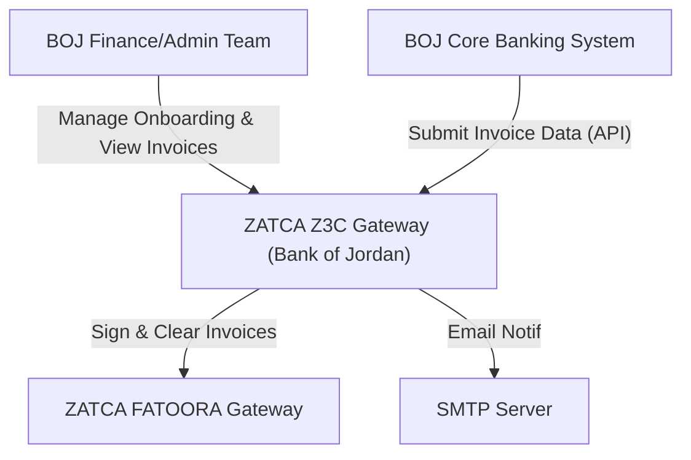
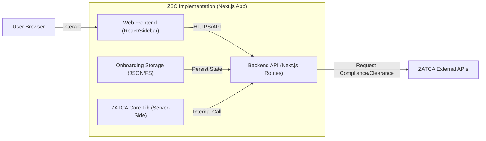
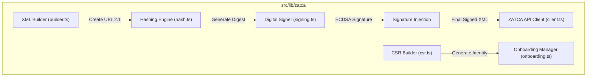

# 🏗️ C4 Architecture Model - ZATCA Z3C Gateway (Bank of Jordan)

This document provides a comprehensive C4 model breakdown of the Z3C Integration Gateway, ranging from high-level context to internal component interactions.

---

## 🟢 Level 1: System Context
The Context diagram shows how the **Z3C Gateway** interacts with users and external systems.

- **BOJ Finance/Admin**: Primary users managing the EGS (Electronic Generating Soul) lifecycle.
- **Z3C Gateway**: The core system handling signing, hashing, and ZATCA communication.
- **ZATCA FATOORA**: The Saudi Tax Authority's official gateway (Sandbox or Production).

---

## 🔵 Level 2: Container Diagram
The Container diagram breaks down the Z3C system into its primary technical building blocks.

- **Web Frontend**: Built with React and TailwindCSS for a premium UI.
- **Backend API**: Serverless Next.js routes handling business logic and security.
- **Onboarding Storage**: Local persistent storage (`zatca-onboarding.json`) tracking the EGS state (OTP -> CCSID -> PCSID).
- **ZATCA Core Lib**: The engine performing ECDSA signing, SHA-256 hashing, and XML C14N.

---

## 🟡 Level 3: Component Diagram (ZATCA Core Lib)
This level details the internal modules within the Core Library that handle the ZATCA business logic.

- **XML Builder**: Converts simple JSON input into strict UBL 2.1 Standard or Simplified XML.
- **Hashing Engine**: Implements the SHA-256 canonicalization protocol.
- **Digital Signer**: Uses the private key to sign the hash using the `secp256k1` curve.
- **ZATCA API Client**: Handles authentication headers and the synchronous clearance/reporting requests.

---

## 📁 Repository Mapping (Code Level)

| C4 Level | Project Path | Description |
| :--- | :--- | :--- |
| **Container** | `src/app/` | UI Routes and API Handlers. |
| **Component** | `src/lib/zatca/xml/` | XML generation for Standard/Simplified docs. |
| **Component** | `src/lib/zatca/crypto/` | Hashing, signing, and CSR generation. |
| **Component** | `src/lib/zatca/qr/` | TLV-encoded cryptographic QR generation. |

---
*Version: 1.0.0 (Bank of Jordan Audit Ready)*
